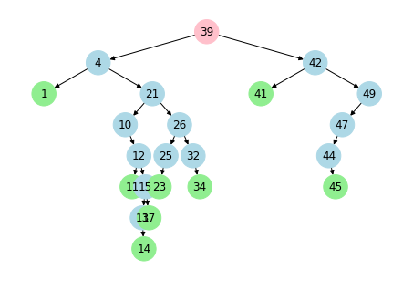
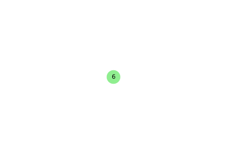
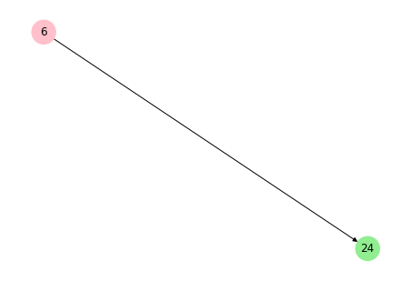
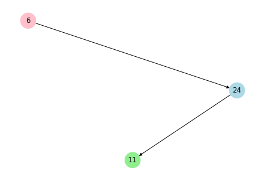
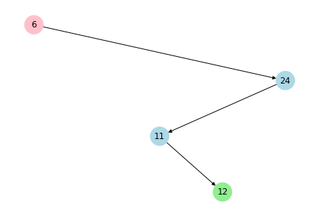
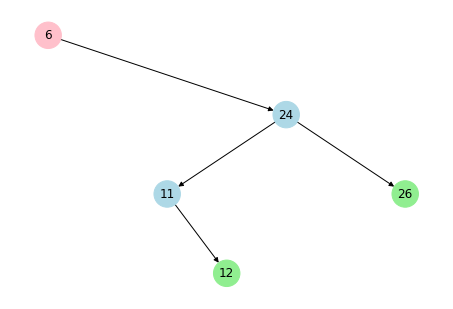
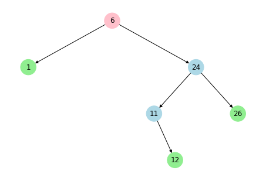
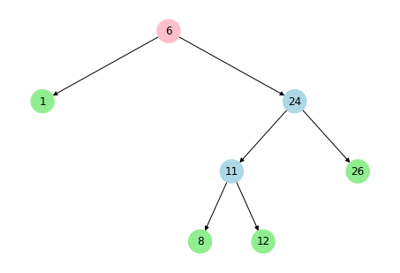
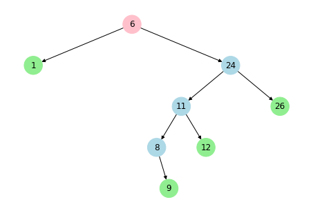
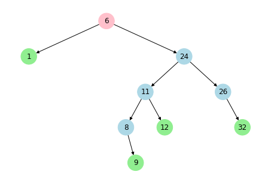

# The python forest
A tiny collection of tree based data structures implemented in python. The package allow to print the structures for a concrete visualization. Main use is for larning and didactic purposes.


```python
## Define some function useful for testing
import random

## generate an array of n random integers up to b
def get_random_array(n, b = 50):
    return [random.randint(0, b) for _ in range(n)]
```


## Tree structures
For the moment only the basic Binary Search Tree (BST) is implemented


### Binary Search Tree


```python
import BST

a = get_random_array(30) #a is an array of random numbers 
bst = BST.BinarySearchTree()

for x in a:
    bst.insert(x)

print(bst)

print("The greatest value is: ", bst.max())
print("The least value is: ",bst.min())
print("The successor of the root number is: ",bst.successor(bst.root.getVal()))
print("The successor of 43 is: ",bst.successor(43))
print("The value in the root is: ",bst.root.val)
print("The predecessor of the greatest value is: ", bst.predecessor(bst.max()))
print("The successor of the least value is: ",bst.successor(bst.min()))
```





    
    The greatest value is:  49
    The least value is:  1
    The successor of the root number is:  41
    The successor of 43 is:  None
    The value in the root is:  39
    The predecessor of the greatest value is:  47
    The successor of the least value is:  4
    

Shows as numbers are inserted in a binary search tree


```python
a = get_random_array(10) #a is an array of random numbers 
print(a,"\n")

bst = BST.BinarySearchTree()

for x in a:
    bst.insert(x)
    print("inserting ",x,":",bst)


```

    [6, 24, 11, 12, 26, 1, 8, 9, 12, 32] 
    
    inserting  6 : 





    
    inserting  24 : 





    
    inserting  11 : 





    
    inserting  12 : 





    
    inserting  26 : 





    
    inserting  1 : 





    
    inserting  8 : 





    
    inserting  9 : 


    
    inserting  12 : 





    
    inserting  32 : 





    
    
